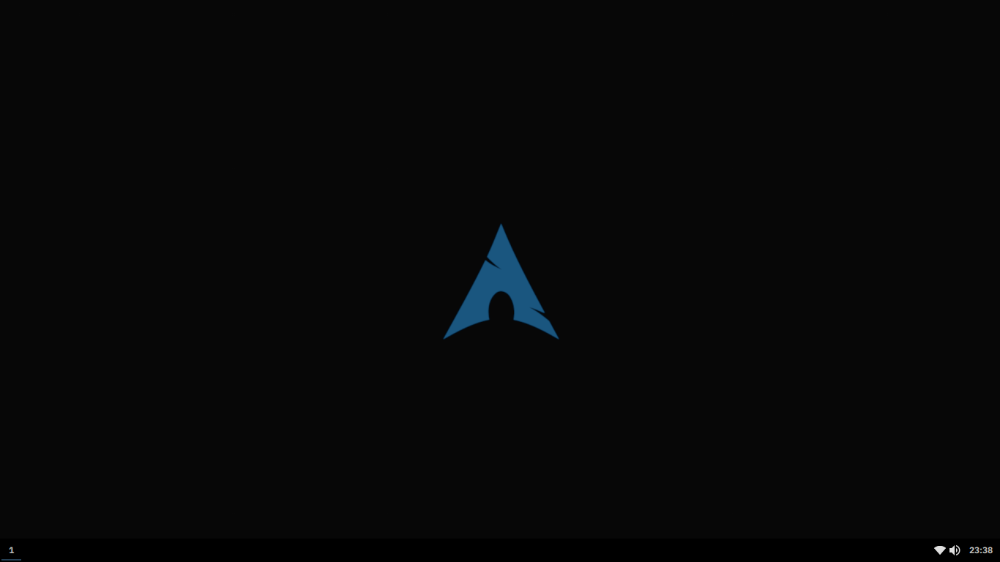
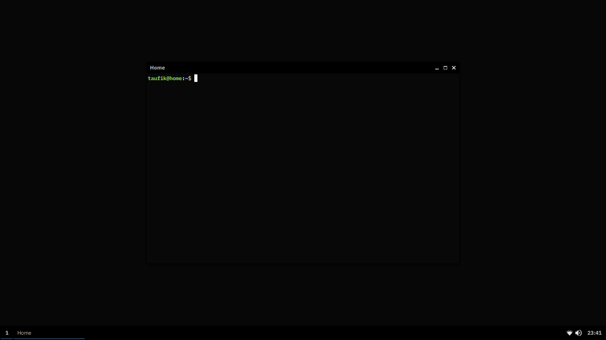
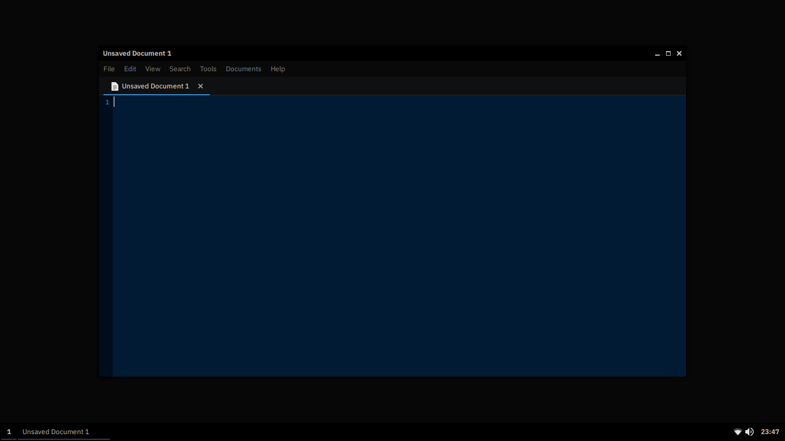
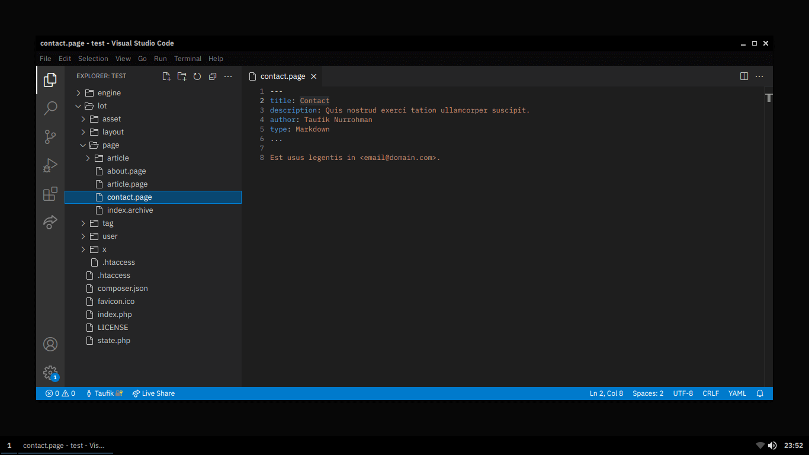
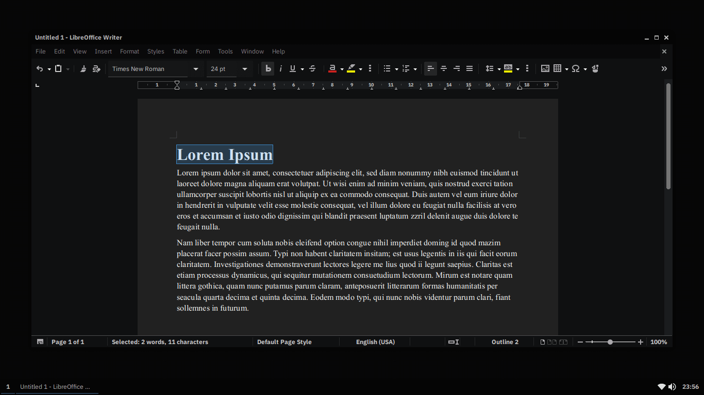

My Minimalist Desk Setup
========================

Dependencies
------------

Optional Dependencies
---------------------

[ the `alsamixer` and `amixer` utilities for `volumeicon`.")](https://archlinux.org/packages/extra/x86_64/alsa-utils/)

[.")](https://archlinux.org/packages/community/x86_64/xarchiver/)

 - `gammy` → Brightness and color temperature controls.
 - `jmtpfs` → Optional dependency for `mtpfs`.

My Keyboard Shortcuts
---------------------

Keys | Description
---- | -----------
<kbd>F11</kbd> | Toggle full screen window.
<kbd>Print</kbd> | Capture the whole screen (wait for 10 seconds).
<kbd>⌥</kbd> <kbd>F4</kbd> | Close window.
<kbd>⌥</kbd> <kbd>⇥</kbd> | Focus to the next window.
<kbd>⌥</kbd> <kbd>⇧</kbd> <kbd>⇥</kbd> | Focus to the previous window.
<kbd>⎈</kbd> <kbd>Print</kbd> | Capture the whole screen without the pointer (wait for 10 seconds).
<kbd>❖</kbd> <kbd>Home</kbd> | Minimize all windows except the currently focused window.
<kbd>❖</kbd> <kbd>Print</kbd> | Capture screen by mouse click or mouse selection (wait for 1 second after mouse release).
<kbd>❖</kbd> <kbd>d</kbd> | Toggle desktop.
<kbd>❖</kbd> <kbd>e</kbd> | Open file explorer.
<kbd>❖</kbd> <kbd>m</kbd> | Minimize all windows.
<kbd>❖</kbd> <kbd>r</kbd> | Run a command.
<kbd>❖</kbd> <kbd>s</kbd> | Run an application.
<kbd>❖</kbd> <kbd>t</kbd> | Open terminal.
<kbd>❖</kbd> <kbd>←</kbd> | Move window to the left and resize its width to 50%, height to 100%.
<kbd>❖</kbd> <kbd>↑</kbd> | Maximize window.
<kbd>❖</kbd> <kbd>→</kbd> | Move window to the right and resize its width to 50%, height to 100%.
<kbd>❖</kbd> <kbd>↓</kbd> | Unmaximize window or minimize window.
<kbd>❖</kbd> <kbd>↵</kbd> | Toggle maximize window.
<kbd>❖</kbd> <kbd>⎈</kbd> <kbd>←</kbd> | Move to the previous desktop if any.
<kbd>❖</kbd> <kbd>⎈</kbd> <kbd>→</kbd> | Move to the next desktop if any.
<kbd>❖</kbd> <kbd>␣</kbd> | Toggle window decoration.

Notes
-----

Dependency and optional dependency can be installed directly via [Pacman](https://archlinux.org/packages). If it is somehow could not be installed, then it should be in the [AUR](https://aur.archlinux.org).

Think of this project as your home folder. Configuration files are intended only to decorate the `openbox` and `tint2` (and also to set the [wallpaper](https://thewallpaper.co/landscape-mountainautumn-leaves-road-nature-desktop-wallpapers-green-fall-colorful-download-hd-wallpapers-path-wallpaper-for-smart-pnone-treeshd-wallpapers/)). Application styles are mostly not handled by these files. You have to find the right theme to be combined with this dark color scheme.

Copy and paste the files to your home folder.

Remove this `README.md` file and then restart your computer!

Visit [this project page](https://github.com/taufik-nurrohman/vim) to configure the Vim editor.

Reminders
---------

The following are tasks that I personally need but often forget. They are not required to make your Arch Linux look like the screenshots above.

### Arch

I am currently dual booting Linux and Windows, which somehow messed up the time. This command should fix the issue:

~~~ .sh
sudo timedatectl set-local-rtc 1 --adjust-system-clock
~~~

### LAMP (Linux, Apache, MySQL, PHP/Perl/Python)

I don&rsquo;t need Perl and Python for everyday life, and sometimes they are just installed anyway as dependencies of certain applications on Linux. So here I will focus on the installation and settings for Apache and PHP only.

#### Step 1: Install Apache

~~~ .sh
sudo pacman -Syu apache
~~~

The main configuration file is `/etc/httpd/conf/httpd.conf`, which includes various other configuration files. The default configuration file should be fine for a simple setup. By default, it will serve the directory `/srv/http` to anyone who visits your website.

Start Apache service:

~~~ .sh
sudo systemctl enable httpd.service
~~~

Apache should now be running. Test by visiting `http://127.0.0.1` in a web browser.

Allow to override the base configurations using `.htaccess` files by changing the directive in `/etc/httpd/conf/httpd.conf` from `AllowOverride None` to `AllowOverride All`:

~~~ .apacheconf
<Directory "/srv/http">
  Options Indexes FollowSymLinks
  AllowOverride All
  Require all granted
</Directory>
~~~

Enable `mod_rewrite` module by uncommenting the following line:

~~~ .apacheconf
#LoadModule rewrite_module modules/mod_rewrite.so
~~~

Disable user&rsquo;s `public_html` directory from being on the web server by commenting this line in `/etc/httpd/conf/httpd.conf`:

~~~ .apacheconf
Include conf/extra/httpd-userdir.conf
~~~

Since I use this web server for development tools, it never hurts to make `/srv/http` folder accessible by me so that I can do file management in there freely:

~~~ .apacheconf
<IfModule unixd_module>
  User taufik
  Group taufik
</IfModule>
~~~

Then:

~~~ .sh
sudo chown taufik:taufik /srv/http
~~~

Don&rsquo;t forget to restart apache after update:

~~~ .sh
sudo systemctl restart httpd.service
~~~

_To be continued._

#### Step 2: Install PHP

This method is probably the easiest, but is also the least scalable: it is suitable for a light request load. It also requires you to change the MPM module, which may cause problems with other extensions (e.g. it is not compatible with HTTP/2).

~~~ .sh
sudo pacman -Syu php-apache php-gd
~~~

In `/etc/httpd/conf/httpd.conf`, comment this line:

~~~ .apacheconf
LoadModule mpm_event_module modules/mod_mpm_event.so
~~~

&hellip; and uncomment this line:

~~~ .apacheconf
#LoadModule mpm_prefork_module modules/mod_mpm_prefork.so
~~~

To enable PHP, add these lines to `/etc/httpd/conf/httpd.conf`:

Place this at the end of the `LoadModule` list:

~~~ .apacheconf
LoadModule php_module modules/libphp.so
AddHandler php-script .php
~~~

Place this at the end of the `Include` list:

~~~ .apacheconf
Include conf/extra/php_module.conf
~~~

Next, uncomment this line in `/etc/php/php.ini` to enable GD:

~~~ .sh
;extension=gd
~~~

Don&rsquo;t forget to restart apache after update:

~~~ .sh
sudo systemctl restart httpd.service
~~~

_To be continued._

### Node.js

First, install whatever versions of NodeJS and NPM are available. This will install a (probably) outdated version of NodeJS and NPM:

~~~ .sh
sudo pacman -Syu nodejs npm
~~~

Next, you need to update NPM. To update NPM, simply run the following:

~~~ .sh
sudo npm i -g npm
~~~

Then, install the package `n`:

~~~ .sh
sudo npm i -g n
~~~

Use `n` to install the latest:

~~~ .sh
sudo n latest
~~~

&hellip; or latest long-term support version of Node.js:

~~~ .sh
sudo n lts
~~~

Credits
-------

 - [Material Black Theme](https://www.opendesktop.org/p/1316887)
 - [Papirus Icon Theme](https://www.opendesktop.org/p/1166289)
