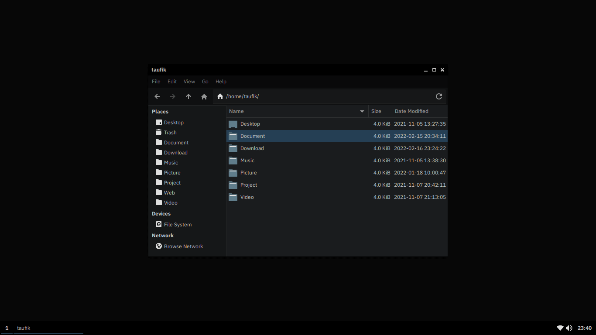

My Minimalist Desk Setup
========================

Dependencies
------------

~~~ sh
sudo pacman -Syu archlinux-xdg-menu feh firefox-developer-edition gvfs gvfs-gphoto2 gvfs-mtp mtpfs iwd network-manager-applet networkmanager ntfs-3g openbox picom rofi rxvt-unicode scrot thunar tint2 ttf-dejavu ttf-ibm-plex ttf-liberation unclutter urxvt-perls vim volumeicon xorg-server xorg-xinit
~~~

Optional Dependencies
---------------------

[ the `alsamixer` and `amixer` utilities for `volumeicon`.")](https://archlinux.org/packages/extra/x86_64/alsa-utils/)

[.")](https://archlinux.org/packages/extra/x86_64/xarchiver/)

~~~ sh
sudo pacman -Syu adobe-source-han-sans-otc-fonts alsa-utils arandr chromium drawing gimp jmtpfs libreoffice-fresh lxappearance obconf onboard simple-scan thunar-archive-plugin thunar-media-tags-plugin tumbler vlc xarchiver xed
~~~

My Keyboard Shortcuts
---------------------

Keys | Description
---- | -----------
<kbd>F11</kbd> | Toggle full screen window.
<kbd>Print</kbd> | Capture the whole screen (wait for 10 seconds).
<kbd>⌥</kbd> <kbd>F4</kbd> | Close window.
<kbd>⌥</kbd> <kbd>⇥</kbd> | Focus to the next window.
<kbd>⌥</kbd> <kbd>⇧</kbd> <kbd>⇥</kbd> | Focus to the previous window.
<kbd>⎈</kbd> <kbd>Print</kbd> | Capture the whole screen without the pointer (wait for 10 seconds).
<kbd>❖</kbd> <kbd>Home</kbd> | Minimize all windows except the currently focused window.
<kbd>❖</kbd> <kbd>Print</kbd> | Capture screen by mouse click or mouse selection (wait for 1 second after mouse release).
<kbd>❖</kbd> <kbd>d</kbd> | Toggle desktop.
<kbd>❖</kbd> <kbd>e</kbd> | Open file explorer.
<kbd>❖</kbd> <kbd>m</kbd> | Minimize all windows.
<kbd>❖</kbd> <kbd>r</kbd> | Run a command.
<kbd>❖</kbd> <kbd>s</kbd> | Run an application.
<kbd>❖</kbd> <kbd>t</kbd> | Open terminal.
<kbd>❖</kbd> <kbd>←</kbd> | Move window to the left and resize its width to 50%, height to 100%.
<kbd>❖</kbd> <kbd>↑</kbd> | Maximize window.
<kbd>❖</kbd> <kbd>→</kbd> | Move window to the right and resize its width to 50%, height to 100%.
<kbd>❖</kbd> <kbd>↓</kbd> | Unmaximize window or minimize window.
<kbd>❖</kbd> <kbd>↵</kbd> | Toggle maximize window.
<kbd>❖</kbd> <kbd>⎈</kbd> <kbd>←</kbd> | Move to the previous desktop if any.
<kbd>❖</kbd> <kbd>⎈</kbd> <kbd>→</kbd> | Move to the next desktop if any.
<kbd>❖</kbd> <kbd>␣</kbd> | Toggle window decoration.

Notes
-----

Dependency and optional dependency can be installed directly via [Pacman](https://archlinux.org/packages). If it is somehow could not be installed, then it should be in the [AUR](https://aur.archlinux.org).

Think of this project as your home folder. Configuration files are intended only to decorate the `openbox` and `tint2` (and also to set the [wallpaper](https://thewallpaper.co/landscape-mountainautumn-leaves-road-nature-desktop-wallpapers-green-fall-colorful-download-hd-wallpapers-path-wallpaper-for-smart-pnone-treeshd-wallpapers/)). Application styles are mostly not handled by these files. You have to find the right theme to be combined with this dark color scheme.

Copy and paste the files to your home folder.

Remove this `README.md` file and then restart your computer!

Visit [this project page](https://github.com/taufik-nurrohman/vim) to configure the Vim editor.

Reminders
---------

The following are tasks that I personally need but often forget. They are not required to make your Arch Linux to look like the screenshots above.

### Arch

I am currently dual booting Linux and Windows, which somehow messed up the time. This command should fix the issue:

~~~ sh
sudo timedatectl set-local-rtc 1 --adjust-system-clock
~~~

### LAMP (Linux, Apache, MariaDB/MySQL, PHP/Perl/Python)

I don’t need Perl and Python for everyday life, and sometimes they are just installed anyway as dependencies of certain applications on Linux. So here I will focus on the installation and settings for Apache and PHP only.

#### Step 1: Install Apache

~~~ sh
sudo pacman -S apache
~~~

The main configuration file is `/etc/httpd/conf/httpd.conf`, which includes various other configuration files. The default configuration file should be fine for a simple setup. By default, it will serve the directory `/srv/http` to anyone who visits your website.

Start Apache service:

~~~ sh
sudo systemctl enable httpd
~~~

Apache should now be running. Test by visiting `http://127.0.0.1` in a web browser.

Allow to override the base configurations using `.htaccess` files by changing the directive in `/etc/httpd/conf/httpd.conf` from `AllowOverride None` to `AllowOverride All`:

~~~ apacheconf
<Directory '/srv/http'>
  Options Indexes FollowSymLinks
  AllowOverride All
  Require all granted
</Directory>
~~~

Enable `mod_rewrite` module by uncommenting the following line:

~~~ apacheconf
#LoadModule rewrite_module modules/mod_rewrite.so
~~~

Disable user’s `public_html` directory from being on the web server by commenting this line in `/etc/httpd/conf/httpd.conf`:

~~~ apacheconf
Include conf/extra/httpd-userdir.conf
~~~

Since I use this web server for development tools, it never hurts to make `/srv/http` folder accessible by me so that I can do file management in there freely:

~~~ apacheconf
<IfModule unixd_module>
  User taufik
  Group taufik
</IfModule>
~~~

Then:

~~~ sh
sudo chown taufik:taufik /srv/http
~~~

Enable the virtual host feature by uncommenting the following line, so that you can have multiple web root in a single `/srv/http` folder:

~~~ apacheconf
#Include conf/extra/httpd-vhosts.conf
~~~

In `/etc/httpd/conf/extra/httpd-vhosts.conf` file, replace the contents with this:

~~~ apacheconf
# Point `http://127.0.0.1` and `http://localhost` to `/srv/http` folder
<VirtualHost *:80>
  DocumentRoot '/srv/http'
  ErrorLog '/var/log/httpd/error_log'
  ServerName localhost
</VirtualHost>

# Point `http://work-1.test` to `/srv/http/work-1.test` folder
<VirtualHost *:80>
  CustomLog '/var/log/httpd/work-1.test.access_log' common
  DocumentRoot '/srv/http/work-1.test'
  ErrorLog '/var/log/httpd/work-1.test.error_log'
  ServerAdmin webmaster@work-1.test
  ServerName work-1.test
  <Directory '/srv/http/work-1.test'>
    Require all granted
  </Directory>
</VirtualHost>

# Point `http://work-2.test` to `/srv/http/work-2.test` folder
<VirtualHost *:80>
  CustomLog '/var/log/httpd/work-2.test.access_log' common
  DocumentRoot '/srv/http/work-2.test'
  ErrorLog '/var/log/httpd/work-2.test.error_log'
  ServerAdmin webmaster@work-2.test
  ServerName work-2.test
  <Directory '/srv/http/work-2.test'>
    Require all granted
  </Directory>
</VirtualHost>
~~~

Don’t forget to restart apache after update:

~~~ sh
sudo systemctl restart httpd
~~~

#### Step 2: Install PHP

This method is probably the easiest, but is also the least scalable: it is suitable for a light request load. It also requires you to change the MPM module, which may cause problems with other extensions (e.g. it is not compatible with HTTP/2).

~~~ sh
sudo pacman -S php-apache php-gd
~~~

In `/etc/httpd/conf/httpd.conf`, comment this line:

~~~ apacheconf
LoadModule mpm_event_module modules/mod_mpm_event.so
~~~

… and uncomment this line:

~~~ apacheconf
#LoadModule mpm_prefork_module modules/mod_mpm_prefork.so
~~~

To enable PHP, add these lines to `/etc/httpd/conf/httpd.conf`:

Place this at the end of the `LoadModule` list:

~~~ apacheconf
LoadModule php_module modules/libphp.so
AddHandler php-script .php
~~~

Place this at the end of the `Include` list:

~~~ apacheconf
Include conf/extra/php_module.conf
~~~

Next, uncomment this line in `/etc/php/php.ini` to enable GD:

~~~ ini
;extension=gd
~~~

Don’t forget to restart apache after update:

~~~ sh
sudo systemctl restart httpd
~~~

### MariaDB

First, install `mariadb` package from terminal:

~~~ sh
sudo pacman -S mariadb
~~~

Then run the following task:

~~~ sh
mariadb-install-db --user=mysql --basedir=/usr --datadir=/var/lib/mysql
~~~

Add a password for `root` user:

~~~ sh
sudo mariadb -u root
~~~

You should now be in MariaDB command line mode:

~~~ sh
MariaDB [(none)]>
~~~

Type this command where `******` is your new password for the `root` user, then <kbd>↵</kbd>:

~~~ mysql
ALTER USER 'root'@'localhost' IDENTIFIED BY '******';
~~~

Then:

~~~ mysql
GRANT ALL PRIVILEGES ON *.* TO 'root'@'localhost' WITH GRANT OPTION;
~~~

Type this command then <kbd>↵</kbd>:

~~~ mysql
FLUSH PRIVILEGES;
~~~

Now exit from MariaDB command line mode:

~~~ sh
exit
~~~

Test it:

~~~ sh
mariadb -u root -p
~~~

### Node.js

First, install whatever versions of NodeJS and NPM are available. This will install a (probably) outdated version of NodeJS and NPM:

~~~ sh
sudo pacman -S nodejs npm
~~~

Next, you need to update NPM. To update NPM, simply run the following:

~~~ sh
sudo npm i -g npm
~~~

Then, install the package `n`:

~~~ sh
sudo npm i -g n
~~~

Use `n` to install the latest:

~~~ sh
sudo n latest
~~~

… or latest long-term support version of Node.js:

~~~ sh
sudo n lts
~~~

Surgery
-------

In most cases you may run into problems with your current Arch Linux installation while you are experimenting with a particular package. These problems can actually be fixed but are often hampered due to the difficulty of accessing the terminal CLI when you are stuck in a certain condition while booting into the operating system’s GUI.

The following are some ways you can do to be able to enter into the terminal mode when something unexpected happens. All of these methods do not require the installation medium and internet access:

### Stuck in the GRUB Rescue

_TODO_

### Stuck in the GRUB Screen

_TODO_

### Stuck in the Log-In Prompt

Always returns to the log-in prompt after entering the password so it gives the impression that you have repeatedly entered the wrong password. The real issue is that your computer failed to execute the `startx` command, so there could be a problem with the display manager.

Reboot the Arch Linux and go the the GRUB boot loader screen, choose the first option ‘Arch Linux’. Immediately press the <kbd>e</kbd> key to enter in the edit mode. Go to the command line which looks more or less like this:

~~~ sh
linux    /boot/vmlinuz-linux root=UUID=****** rw    loglevel=3 quiet
~~~

Append `init=/bin/bash` at the end of the line so that the line will look like this:

~~~ sh
linux    /boot/vmlinuz-linux root=UUID=****** rw    loglevel=3 quiet init=/bin/bash
~~~

Now press <kbd>⎈</kbd><kbd>x</kbd> or <kbd>F10</kbd> to boot Arch Linux in single user mode. Below window confirms that we have entered in single user mode or rescue mode:

~~~ sh
[root@archlinux /]# _
~~~

To run commands and perform troubleshooting steps, you have to first mount root file system (`/`) in read-write mode. Run the following command to mount `/` file system in read-write mode:

~~~ sh
mount -n -o remount,rw /
~~~

Now you can perform checks and repairs on your file system. As a start, you may want to try executing command `ls` in the terminal. Since the issue was with the display manager, you may need to temporarily disable the automatic `startx` feature:

~~~ sh
cd /home/taufik
vim .bash_profile
~~~

Then comment out these lines:

~~~ sh
if [ -z "${DISPLAY}" ] && [ "${XDG_VTNR}" -eq 1 ];
then
    [[ $(fgconsole 2>/dev/null) == 1 ]] && exec startx -- vt1 &> /dev/null
fi
~~~

Save changes and exit.

Once the checks and repairs are done, run this command to reboot:

~~~ sh
exec /sbin/init
~~~

If the problem is resolved, then you can perform further repairs specific to the display manager:

#### Failed Installing NVIDIA

Tried installing NVIDIA recently and ended up failing. Now you can’t return to the previous state even though you have uninstalled the driver. Based on my experience, this happens because NVIDIA has added a configuration file that blacklist [Nouveau](https://wiki.archlinux.org/title/nouveau). The easiest solution for now is to un-blacklist Nouveau:

~~~ sh
sudo vim /usr/lib/modprobe.d/nvidia-utils.conf
~~~

Comment out this line, save, then reboot:

~~~ sh
blacklist nouveau
~~~

NVIDIA driver will be useless now, but at least you can learn to configure it properly next time.

Credits
-------

 - [How to Boot Arch Linux in Single User Mode/Rescue Mode](https://www.linuxtechi.com/boot-arch-linux-single-user-mode-rescue-mode)
 - [Material Black Theme](https://www.opendesktop.org/p/1316887)
 - [Papirus Icon Theme](https://www.opendesktop.org/p/1166289)